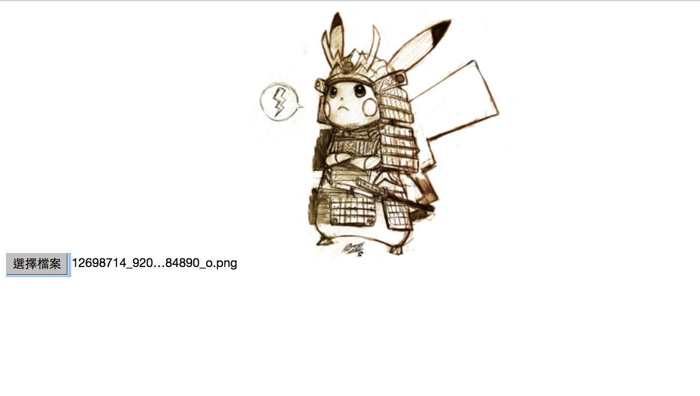

# Paperclip AJAX upload

本篇臨摹自[Ruby on Rails 4 + Paperclip gem： Ajax image upload](http://1c7.me/2016/07/17/ajax-image-upload-with-rails-paperclip.html)

`wiki`資料夾下有最初筆記，[GitHub wiki](https://github.com/NickWarm/paperclip_AJAX_upload_WG/wiki)頁面也有一份，方便以後查找資料

demo影片：https://youtu.be/xYiZ-b74KaQ

# 專案的branchs
- **master**：臨摹的原始內容

- **medium**：修改懲教恰當的圖片大小

