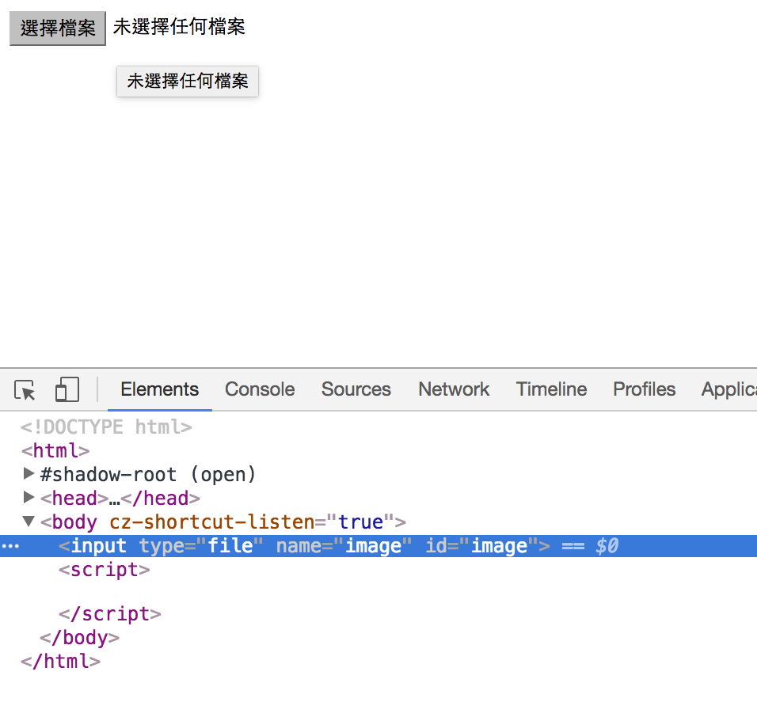
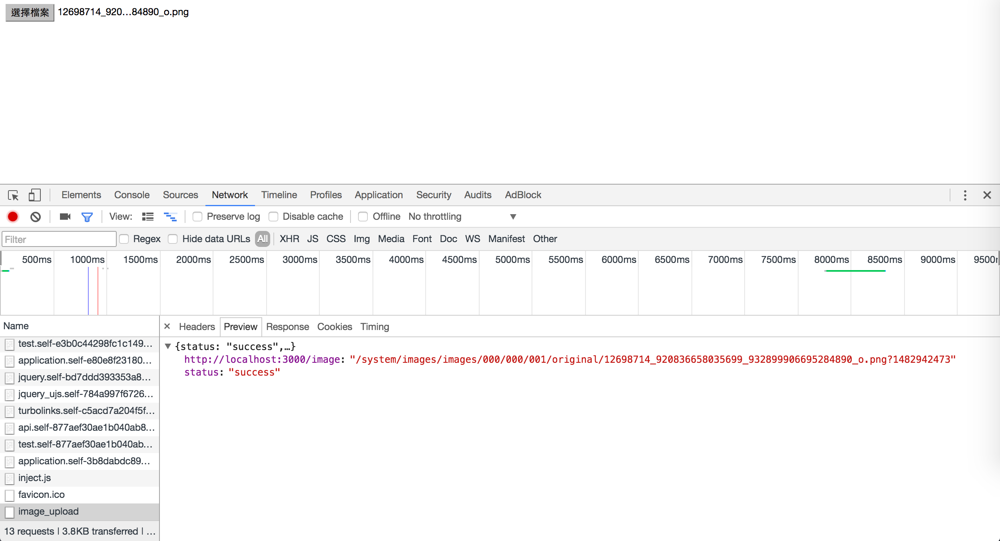
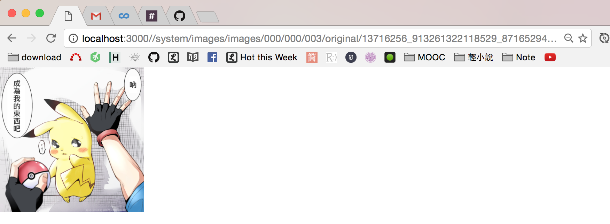

# 出處

本篇臨摹自[Ruby on Rails 4 + Paperclip gem： Ajax image upload](http://1c7.me/2016/07/17/ajax-image-upload-with-rails-paperclip.html)

# 環境設定

add `gem 'paperclip', '~> 5.0.0'` to `Gemfile` and then `bundle install`

## 設定Image model

`rails g model Image`

在`image` model弄好paperclip的設定

edit `app/models/image.rb`

```
class Image < ActiveRecord::Base
  has_attached_file :image, styles: { medium: "300x300>", thumb: "100x100>" }
  validates_attachment_content_type :image, content_type: /\Aimage\/.*\Z/
end
```

## 加入欄位

`rails g migration addAttachmentToImage`

edit `app/db/migrate/20161228144414_add_attachment_to_image.rb`

```
class AddAttachmentToImage < ActiveRecord::Migration
  def up
    add_attachment :images, :image
  end

  def down
    remove_attachment :images, :image
  end
end
```

and then `rake db:migrate`

## 插曲：開API

接下來對我來說就是新東西了，我們要開API接口，讓AJAX可以串起來，開始之前先閱讀一些手邊的資料
- [Ruby on Rails 實戰聖經 | 實作 Web APIs](https://ihower.tw/rails/web-api.html)
  - [rails-exercise-ac8/config/routes.rb](https://github.com/ihower/rails-exercise-ac8/blob/master/config/routes.rb)
  - [rails-exercise-ac8/app/controllers/api_v1/topics_controller.rb
](https://github.com/ihower/rails-exercise-ac8/blob/master/app/controllers/api_v1/topics_controller.rb)
  - [rails-exercise-ac8/app/controllers/api_controller.rb](https://github.com/ihower/rails-exercise-ac8/blob/master/app/controllers/api_controller.rb)
- [Creating a Rails API and Making Requests with jQuery AJAX | Ruby/Rails Programming](https://codequizzes.wordpress.com/2013/07/10/creating-a-rails-api-and-making-requests-with-jquery-ajax/)


## 插曲：scope
資料都查完了才發現臨摹的範例沒有用scope寫API的路由...，沒關係，到時候開branch路由用scope的寫法

路由的scope
- [Scope 規則 - Ruby on Rails 實戰聖經 | 路由(Routing)](https://ihower.tw/rails/routing.html#sec6)
- [rails API - routing - scope](http://api.rubyonrails.org/classes/ActionDispatch/Routing/Mapper/Scoping.html#method-i-scope)
- [rails API - ActionDispatch::Routing](http://api.rubyonrails.org/classes/ActionDispatch/Routing.html)，看「Resources」這節，搜尋「scope」
- [rails API - ActionDispatch::Routing::Mapper::Scoping](http://api.rubyonrails.org/classes/ActionDispatch/Routing/Mapper/Scoping.html)
- [2.6 Controller 命名空間與路由 - Rails 路由：深入淺出 — Ruby on Rails 指南](http://rails.ruby.tw/routing.html#controller-命名空間與路由)


model的scope
- [scope | Rails 102](https://rocodev.gitbooks.io/rails-102/content/chapter1-mvc/m/scope.html)
- [Ruby on Rails 實戰聖經 | ActiveRecord Query Interface - 資料表操作 - Scopes 作用域](https://ihower.tw/rails/activerecord-query.html#sec6)
- [rails API - ActiveRecord::Scoping::Named::ClassMethods - scope](http://api.rubyonrails.org/classes/ActiveRecord/Scoping/Named/ClassMethods.html#method-i-scope)
- [14 作用域 - Active Record 查詢 — Ruby on Rails 指南](http://rails.ruby.tw/active_record_querying.html#作用域)

# 路由設定

在此先繼續範例的寫法，來設定路由

edit `routes.rb`

```
Rails.application.routes.draw do
  # View
  get '/image' => 'test#image'
  # AJAX
  put 'api/image_upload' => 'api#image_upload', as: :image_upload
end
```

as
- [1.2 產生路徑與網址 - Rails 路由：深入淺出 — Ruby on Rails 指南](http://rails.ruby.tw/routing.html#產生路徑與網址)

# 建立controller

`rails g controller test image`

`rails g controller api image_upload`

# 頁面設定

edit `app/views/test/image.html.erb`

一開始先寫

```
<%= file_field_tag :image %>
```

接著我們開chrome工具查看，可以看到會生成一個input tag，type為`file`，id為`image`



我們的目標，是選完圖片後，自動AJAX上傳圖片，所以keep coding `app/views/test/image.html.erb`

```
<script>
  $('#image').change(function(){
    var formData = new FormData();

  })
</script>
```

很快就遇到第一個沒學過的東西：`FormData`
- [問關於 Javascript FormData的問題 - 求救 - Rails Fun!! Ruby & Rails 中文論壇](http://railsfun.tw/t/javascript-formdata/381/2)
  - JC在這篇有說到，jQuery要用AJAX可以用`.serialize()`而不需要`FormData`
  - 難怪我昨天看到AJAX的寫法都是用`.serialize()`寫的
    - [comment1：Submit form in rails 3 in an ajax way (with jQuery) - Stack Overflow](http://stackoverflow.com/a/6723501)
      - [.serialize() | jQuery API Documentation](https://api.jquery.com/serialize/)
- [comment1：javascript - FormData vs .serialize(), What is the difference? - Stack Overflow](http://stackoverflow.com/a/33469738)
  - 不過看到這篇，才知道為何上傳檔案不能用`.serialize()`，最關鍵的就是這句話「you can't serialize files, only file names.」

FormData
- [FormData() - Web APIs | MDN](https://developer.mozilla.org/en-US/docs/Web/API/FormData/FormData)
- 這個example很符合我們用paperclip上傳圖片的情境：[Example - FormData.append() - Web APIs | MDN](https://developer.mozilla.org/en-US/docs/Web/API/FormData/append#Example)
- [comment1：javascript - FormData vs .serialize(), What is the difference? - Stack Overflow](http://stackoverflow.com/a/33469738)

and then keep coding `app/views/test/image.html.erb`

```
<script>
  $('#image').change(function(){
    var formData = new FormData(),
        $input = $(this);
    formData.append('image[image]', $input[0].file[0]);

  })
</script>
```

這邊的`formData.append('image[image]', $input[0].file[0]);`，可以參考下面這篇
- [通过jQuery Ajax使用FormData对象上传文件 - 简书](http://www.jianshu.com/p/46e6e03a0d53)

and then keep coding `app/views/test/image.html.erb`

```
<script>
  $('#image').change(function(){
    var formData = new FormData(),
        $input = $(this);
    formData.append('image[image]', $input[0].file[0]);

    $.ajax({
      url: <%= image_upload_path %>,
      data: formData,
      type: 'PUT',
      cache:false,
      contentType: false,
      processData: false
    });
  })
</script>
```

## 抓蟲趣

實測時發現，沒成功傳出去，回頭研究範例發現我有打錯兩個地方

### 蟲1

```
formData.append('image[image]', $input[0].file[0]);
```

應該用`files[0]`才對，於是改成`formData.append('image[image]', $input[0].files[0]);`

### 蟲2

```
$.ajax({
  url: <%= image_upload_path %>,
  ...
});
```

應該用`url: '...'`才對，於是改成`url: '<%= image_upload_path %>',`

so fix `app/views/test/image.html.erb`

```
<script>
  $('#image').change(function(){
    var formData = new FormData(),
        $input = $(this);
    formData.append('image[image]', $input[0].files[0]);

    $.ajax({
      url: '<%= image_upload_path %>',
      data: formData,
      type: 'PUT',
      cache:false,
      contentType: false,
      processData: false
    });
  })
</script>
```

# 設定controller

剛剛的AJAX我們有看到url傳給`<%= image_upload_path %>`，那是因為我們已經在`route.rb`設定好

```
put 'api/image_upload' => 'api#image_upload', as: :image_upload
```

所以當我們執行AJAX時，會需要api controller去幫我們處理AJAX收到的資料要如何存進database裡去

so edit `app/controller/api_controller.rb`

```
class ApiController < ApplicationController
  def image_upload
    @image = Image.create(img_params)
  end


  private

  def img_params
      params.require(:image).permit(:image)
  end
end
```

and then keep coding `app/controller/api_controller.rb`

```
def image_upload
  @image = Image.create(img_params)

  if @image
    render :json => {:status => 'success', image_url => @image.image.url}
  else
    render :json => {:status => 'fail'}
  end
end
```


`render :json`
- [render (ActionController::Base) - APIdock](http://apidock.com/rails/ActionController/Base/render)，搜尋「Rendering JSON」
- [Ruby on Rails 實戰聖經 | Action Controller - 控制 HTTP 流程 - Render結果](https://ihower.tw/rails/actioncontroller.html#sec3)

## 抓蟲趣 pt.2

下面會有個AJAX顯示圖片，要撈`image_url`，一開始時一直失敗撈不到，chrome工具的console說我的`image_url` undefined。後來回去檢查code發現，`api_controller`那邊應該要用symbol `:image_url`，我卻給它寫成`image_url`

```
render :json => {:status => 'success', image_url => @image.image.url}
```

so fix `app/controller/api_controller.rb`

```
render :json => {:status => 'success', :image_url => @image.image.url}
```

# 實測

上傳成功的資訊



上傳成功的圖片



# 加入即時預覽

edit `app/views/test/image.html.erb`

```
<%= file_field_tag :image %>

```

and then keep coding `app/views/test/image.html.erb`

```
<script>
  $('#image').change(function(){
    var formData = new FormData(),
        $input = $(this);
    formData.append('image[image]', $input[0].files[0]);

    $.ajax({
      url: '<%= image_upload_path %>',
      data: formData,
      type: 'PUT',
      cache:false,
      contentType: false,
      processData: false
    }).done();
  })
</script>
```

and then keep coding

```
<script>
  $('#image').change(function(){
    var formData = new FormData(),
        $input = $(this);
    formData.append('image[image]', $input[0].files[0]);

    $.ajax({
      url: '<%= image_upload_path %>',
      data: formData,
      type: 'PUT',
      cache:false,
      contentType: false,
      processData: false
    }).done(function(result){

    });
  })
</script>
```

and then keep coding

```
.done(function(result){
  console.log(result.image_url);
  $('#preview').attr('src', result.image_url)
});
```
